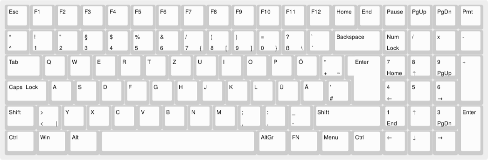
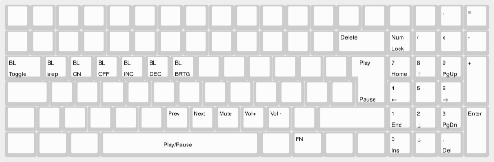

# UNAUSGESCHLAFEN'S BUDGET96
*This is a German Budget96*

## BASE


## FUNCTION


## FLASHING
These notes a for *Ubuntu Linux*.

1\. Hold the left ctrl button while powering on the keyboard puts the keeb in boot mode.

2. Pull and build the bootloader:
```
sudo apt install libusb-dev
wget https://www.obdev.at/downloads/vusb/bootloadHID.2012-12-08.tar.gz
tar -xzf bootloadHID.2012-12-08.tar.gz
cd bootloadHID.2012-12-08/commandline
make
mv bootloadHID /../..
```

3. Build firmware image:
```
make donutcables/budget96:unausgeschlafen
```

4. Flash:
```
./booloadHID -r donutcables_budget96_unausgeschlafen.hex
```

## REFERENCES
- https://github.com/qmk/qmk_firmware/blob/master/docs/flashing_bootloadhid.md
- https://github.com/qmk/qmk_firmware/blob/master/docs/keycodes.md
